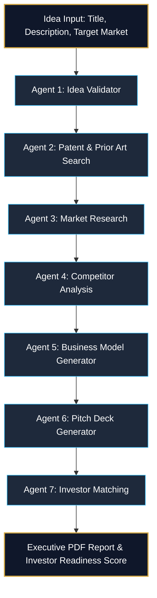

# 🚀 LaunchPad AI — Idea-to-Investor Multi-Agent Startup Accelerator

> **An autonomous 7-agent AI pipeline that validates raw student startup ideas, conducts patent & market research, designs strategic business models, generates pitch decks, and matches startups with real venture capital investors.**

---

## 📌 Overview & Problem Statement

Student entrepreneurs at innovation-driven institutions often have promising ideas but lack structured guidance to move from concept to a fundable venture. Validating an idea, understanding its market and competitive landscape, checking patentability, structuring a business model, and building an investor-ready pitch all require different expertise that most students cannot access without mentors or expensive market reports.

**LaunchPad AI solves this problem by taking a raw startup idea and autonomously executing a 7-stage due diligence pipeline.**

---

## ⚡ Key Features

- **🤖 7-Stage Autonomous AI Pipeline**: Sequential multi-agent execution pipeline evaluating every dimension of a startup.
- **🛡️ Real-Time IP Search & Prior Art Analysis**: Queries live USPTO PatentsView APIs to evaluate freedom-to-operate and patent collision risks.
- **📊 Real Market Research Grounding**: Integrates live web search intelligence to calculate TAM/SAM, CAGR growth trends, and target customer demographics.
- **⚔️ Competitive Matrix & White-Space Mapping**: Identifies market leaders, analyzes their strengths/weaknesses, and highlights strategic differentiation moats.
- **🏛️ Strategic Business Model Canvas**: Generates monetization mechanisms, operational cost structures, acquisition channels, and customer segments.
- **📊 Interactive 8-Slide Pitch Deck Simulator**: Synthesizes pipeline intelligence into boardroom-ready pitch deck slides.
- **🤝 Curated VC Matchmaking**: Evaluates investment thesis compatibility against a real pool of India-focused venture capital funds (*Peak XV, Blume, Accel, Y Combinator, 100X.VC, etc.*).
- **⭐ Investor Readiness Score**: Calculates a weighted 0-100 readiness score and 5-star rating based on diligence outputs.
- **📄 Executive PDF Report Generation**: Exports an executive due diligence PDF report powered by a custom ReportLab rendering engine.
- **📂 Diligence Archive & Submission History**: Dedicated submission archive with search filtering, status badges (`Completed`, `Processing`, `Failed`), and instant report reloading.
- **💎 Luxury Dark Glassmorphism UI**: High-contrast navy and gold visual design system built with Next.js 16 (App Router & Turbopack) and TailwindCSS.

---

## 🔄 Pipeline Architecture & Data Flow



### Multi-Agent Specifications

| Stage | Agent Name | Domain & Responsibility | External Data Grounding |
|---|---|---|---|
| **01** | **Idea Validator** | NLP / Reasoning & Evaluation — Penalizes vagueness against strict scoring rubrics (0-100). | LLM Reasoning Engine |
| **02** | **Patent & Prior Art** | Information Retrieval & IP Research — Assesses patentability and freedom-to-operate. | Live USPTO PatentsView API |
| **03** | **Market Research** | Information Retrieval & Data Analytics — Estimates TAM/SAM and CAGR growth drivers. | Live Web Search (DuckDuckGo/Tavily) |
| **04** | **Competitor Analysis** | Comparative NLP — Maps direct competitors, strengths, weaknesses, and differentiation moats. | Live Web Search Grounding |
| **05** | **Business Model** | Strategic Reasoning — Builds monetization streams, cost drivers, channels, and value proposition. | Agents 3 & 4 Outputs |
| **06** | **Pitch Deck** | Generative Content Creation — Synthesizes 6-8 slide investor pitch deck outlines. | All Prior Agent Outputs |
| **07** | **Investor Matching** | Recommendation System — Matches startup thesis to VC focus areas and calculates Readiness Score. | Real India-Focused VC Dataset |

---

## 🛠️ Tech Stack

### Frontend
- **Framework**: [Next.js 16 (App Router, Turbopack)](https://nextjs.org/)
- **UI Library**: [React 19](https://react.dev/)
- **Styling**: [TailwindCSS 4](https://tailwindcss.com/) (Vanilla CSS Variables, Dark Glassmorphism, Custom Design Tokens)
- **Icons**: [Lucide React](https://lucide.dev/)

### Backend & Orchestration
- **API Framework**: [FastAPI](https://fastapi.tiangolo.com/) (Async endpoints, Server-Sent Events SSE streaming)
- **Database**: [SQLAlchemy](https://www.sqlalchemy.org/) (SQLite / Relational models)
- **PDF Engine**: [ReportLab](https://www.reportlab.com/) (Custom canvas renderer for executive report exports)
- **Server**: [Uvicorn](https://www.uvicorn.org/)

### AI & Multi-Provider LLM Core
- **Primary LLM Routing**: [Google Gemini 2.0 Flash](https://ai.google.dev/), [Groq (LLaMA 3.3 70B)](https://groq.com/), [Cerebras](https://cerebras.ai/)
- **Resilience Architecture**: Automatic multi-key rotation, rate-limit fallback, and **Retry-on-Truncation** mechanism (auto-expands `max_tokens` by 50% on partial JSON cuts).

---

## 📁 Repository Structure

```
LaunchPadAi/
├── agents/                      # 🤖 7 Multi-Agent Modules
│   ├── idea_validator.py        # Agent 1: Idea evaluation & rubric scoring
│   ├── patent_search.py         # Agent 2: USPTO patent & IP risk search
│   ├── market_research.py       # Agent 3: TAM/SAM estimation & growth trends
│   ├── competitor_analysis.py   # Agent 4: Competitor matrix & differentiation
│   ├── business_model.py        # Agent 5: Business model canvas generation
│   ├── pitch_deck.py            # Agent 6: Slide deck outline generator
│   ├── investor_matching.py     # Agent 7: VC matching & readiness score
│   ├── llm_client.py            # Provider-agnostic LLM router & key rotator
│   ├── search_utils.py          # Real web search integration wrappers
│   └── patent_search_client.py  # Live USPTO PatentsView API client
├── backend/                     # ⚙️ FastAPI Orchestration & Database
│   ├── main.py                  # FastAPI server entry point & CORS
│   ├── models.py                # SQLAlchemy Idea & AgentOutput DB schemas
│   ├── database.py              # SQLite database session configuration
│   ├── orchestrator.py          # Sequential pipeline runner & SSE events
│   ├── readiness_calculator.py  # Weighted investor readiness scoring logic
│   ├── report_generator.py     # ReportLab executive PDF generator
│   └── routes/
│       └── ideas.py             # Idea CRUD, execution, SSE, and PDF routes
├── frontend/                    # 🎨 Next.js 16 Glassmorphism Dashboard
│   ├── src/
│   │   ├── app/
│   │   │   ├── page.tsx          # Startup idea submission hero page
│   │   │   ├── pipeline/        # 7-Stage single-card interactive dashboard
│   │   │   └── history/         # Submission archive & search page
│   │   ├── components/          # Reusable UI components & 7 Agent views
│   │   │   └── agents/          # Agent1Validator through Agent7Investors cards
│   │   ├── context/
│   │   │   └── PipelineContext.tsx # Global state management & API polling
│   │   └── types/
│   │       └── agentContracts.ts # TypeScript interfaces for all agent JSON outputs
├── AGENTS.md                    # Shared architecture & contract reference
├── package.json                 # Root npm scripts runner
└── requirements.txt             # Backend Python dependencies
```

---

## 🚦 Getting Started & Local Setup

### Prerequisites

- **Python**: `3.10` or higher
- **Node.js**: `18.0` or higher
- **npm**: `9.0` or higher

---

### Step 1: Clone the Repository & Configure Environment Variables

```bash
git clone https://github.com/sudhir796/LaunchPadAI.git
cd LaunchPadAi
```

Create a `.env` file in the root directory:

```env
# Primary LLM API Keys (Supports single or multiple comma-separated keys)
GEMINI_API_KEY=your_gemini_api_key_here
GROQ_API_KEY=your_groq_api_key_here
CEREBRAS_API_KEY=your_cerebras_api_key_here

# Optional: Preferred Primary Provider (gemini | groq | cerebras)
LLM_PROVIDER=gemini
```

Create a `frontend/.env.local` file:

```env
NEXT_PUBLIC_API_URL=http://127.0.0.1:8000
```

---

### Step 2: Set Up Backend

```bash
# Create Python virtual environment
python -m venv .venv_win

# Activate virtual environment (Windows PowerShell)
.\.venv_win\Scripts\Activate.ps1

# Install required Python packages
pip install -r requirements.txt

# Start FastAPI backend server
uvicorn backend.main:app --host 127.0.0.1 --port 8000 --reload
```

---

### Step 3: Set Up Frontend

In a separate terminal window:

```bash
# Run from root folder (or cd frontend)
npm run dev
```

Open [http://localhost:3000](http://localhost:3000) in your browser to launch the application.

---

## 📡 API Reference

| Method | Endpoint | Description |
|---|---|---|
| `POST` | `/ideas/` | Submit a new startup idea & launch the 7-stage background pipeline. |
| `GET` | `/ideas/` | Retrieve a list of all past submissions (supports `limit` and `offset` pagination). |
| `GET` | `/ideas/{idea_id}` | Fetch full details and 7-agent outputs for a specific startup. |
| `GET` | `/ideas/{idea_id}/stream` | Subscribe to real-time Server-Sent Events (SSE) progress updates. |
| `GET` | `/ideas/{idea_id}/report` | Generate and download the executive ReportLab PDF due diligence report. |
| `POST` | `/ideas/{idea_id}/export-pdf` | Trigger PDF export for stored pipeline outputs. |
| `POST` | `/ideas/{idea_id}/retry/{agent_name}` | Re-trigger an individual agent stage if errors occurred. |

---

## 👥 Team Ownership & Architecture

| Area | Responsibilities | Directory |
|---|---|---|
| **AI Agents** | Prompt engineering, multi-provider LLM routing, search grounding, contract validation. | `/agents/` |
| **Backend & Orchestration** | FastAPI routing, database persistence, SSE event bus, PDF report generation. | `/backend/` |
| **Frontend UI** | Next.js dashboard, dark glassmorphism design system, interactive slide deck, submission archive. | `/frontend/` |

---

## 📄 License

Distributed under the MIT License. See `LICENSE` for more information.
